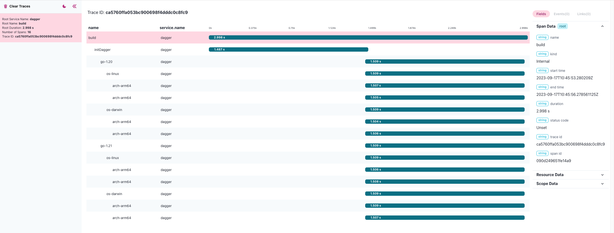

# Dagger SDK

- https://docs.dagger.io/sdk/go/959738/get-started
- https://www.youtube.com/watch?v=GgMskf-znh4

```
go get dagger.io/dagger@latest
go mod edit -replace github.com/docker/docker=github.com/docker/docker@v20.10.3-0.20220414164044-61404de7df1a+incompatible
````


```
go build
./multibuild https://github.com/kpenfound/greetings-api.git
```


## OTEL

### Install

```
brew tap CtrlSpice/homebrew-otel-desktop-viewer
brew tap equinix-labs/otel-cli
brew install otel-desktop-viewer otel-cli
```

### Run basic trace

- 1st terminal

```
export OTEL_SERVICE_NAME="dagger"
export OTEL_EXPORTER_OTLP_ENDPOINT="http://localhost:4318"
export OTEL_TRACES_EXPORTER="otlp"
export OTEL_EXPORTER_OTLP_PROTOCOL="http/protobuf"
otel-desktop-viewer
```

- 2nd terminal

```
export OTEL_EXPORTER_OTLP_ENDPOINT=http://localhost:4318
otel-cli exec --service dagger --name "multibuild" ./multibuild https://github.com/kpenfound/greetings-api.git
```


## Run manual instrumented 

- 1st terminal

```
export OTEL_EXPORTER_OTLP_ENDPOINT="http://localhost:4318"
export OTEL_TRACES_EXPORTER="otlp"
export OTEL_EXPORTER_OTLP_PROTOCOL="http/protobuf"
otel-desktop-viewer
```

- 2nd terminal

```
export OTEL_EXPORTER_OTLP_ENDPOINT=http://localhost:4318
go build
./multibuild https://github.com/kpenfound/greetings-api.git
```

Screenshot from otel-desktop-viewer


